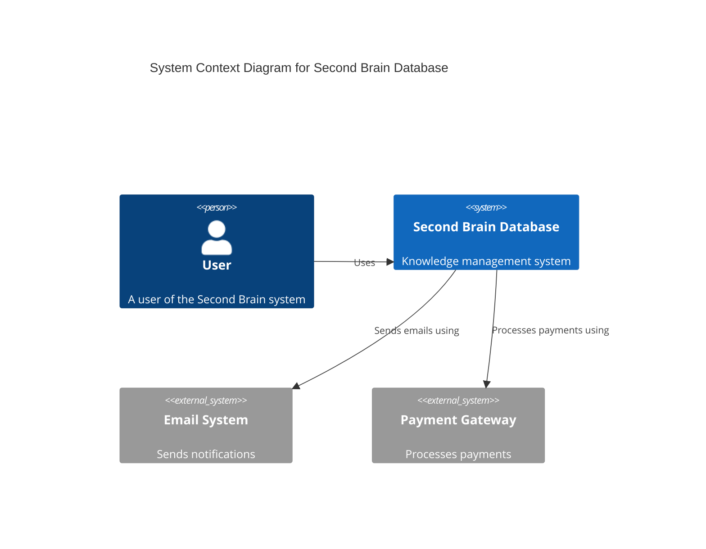
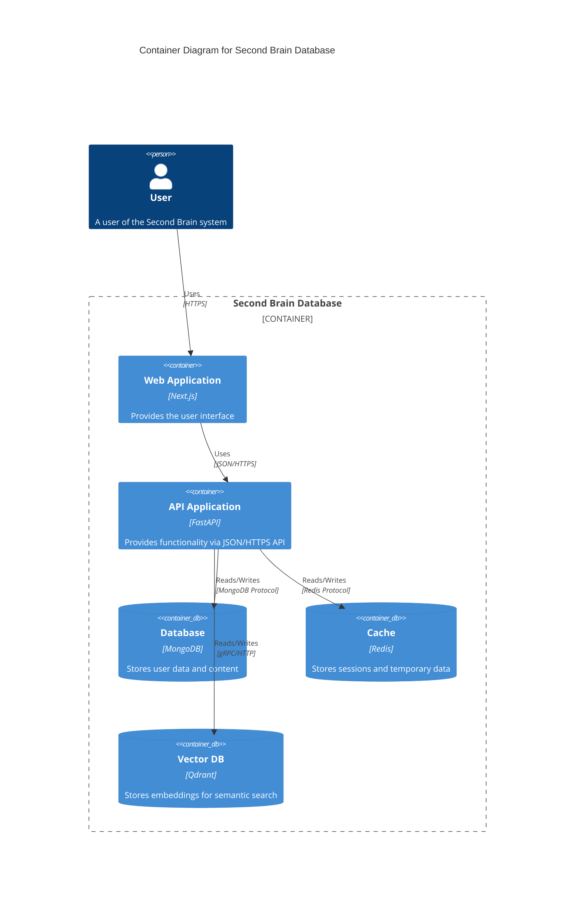
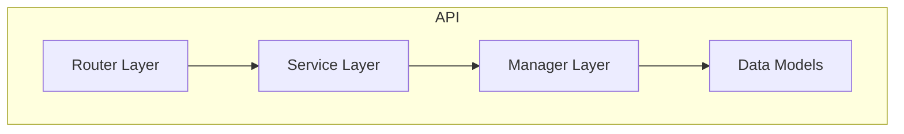

# Architecture Overview

The Second Brain Database is designed as a modular, scalable system.

## System Context

```mermaid
C4Context
    title System Context Diagram for Second Brain Database

    Person(user, "User", "A user of the Second Brain system")
    System(sbd, "Second Brain Database", "Knowledge management system")
    System_Ext(email, "Email System", "Sends notifications")
    System_Ext(payment, "Payment Gateway", "Processes payments")

    Rel(user, sbd, "Uses")
    Rel(sbd, email, "Sends emails using")
    Rel(sbd, payment, "Processes payments using")
```

## Container Diagram

```mermaid
C4Container
    title Container Diagram for Second Brain Database

    Person(user, "User", "A user of the Second Brain system")

    Container_Boundary(c1, "Second Brain Database") {
        Container(web_app, "Web Application", "Next.js", "Provides the user interface")
        Container(api, "API Application", "FastAPI", "Provides functionality via JSON/HTTPS API")
        ContainerDb(database, "Database", "MongoDB", "Stores user data and content")
        ContainerDb(cache, "Cache", "Redis", "Stores sessions and temporary data")
        ContainerDb(vector_db, "Vector DB", "Qdrant", "Stores embeddings for semantic search")
    }

    Rel(user, web_app, "Uses", "HTTPS")
    Rel(web_app, api, "Uses", "JSON/HTTPS")
    Rel(api, database, "Reads/Writes", "MongoDB Protocol")
    Rel(api, cache, "Reads/Writes", "Redis Protocol")
    Rel(api, vector_db, "Reads/Writes", "gRPC/HTTP")
```

## Component Diagram (API)

```mermaid
graph TD
    subgraph API
        Router[Router Layer]
        Service[Service Layer]
        Manager[Manager Layer]
        Model[Data Models]
    end

    Router --> Service
    Service --> Manager
    Manager --> Model
```
